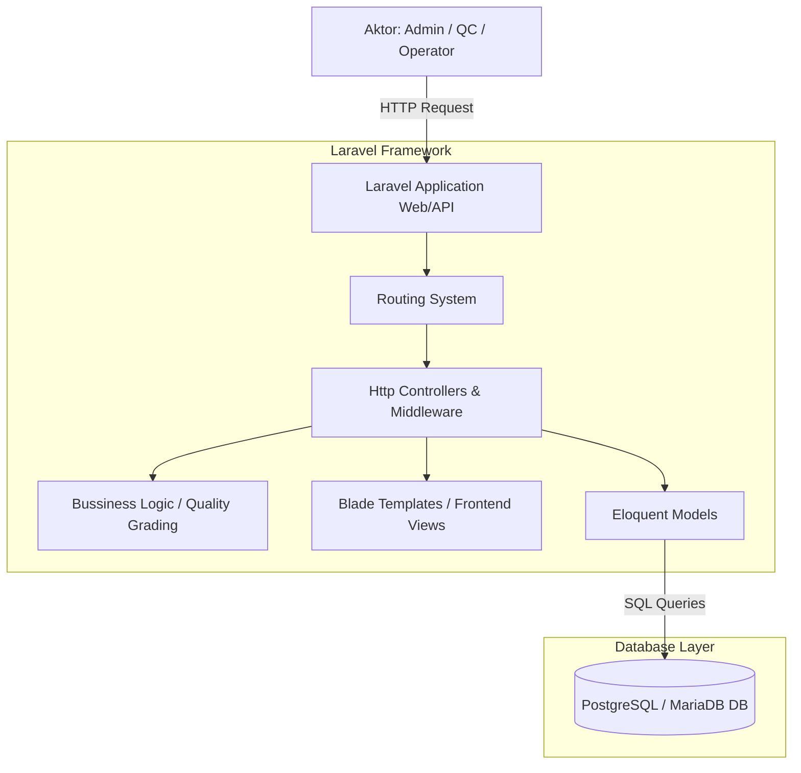
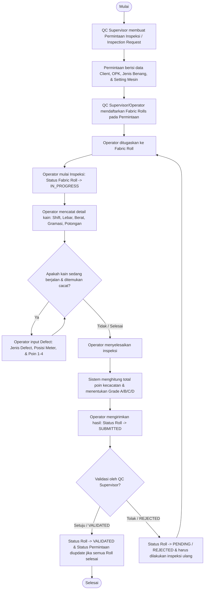
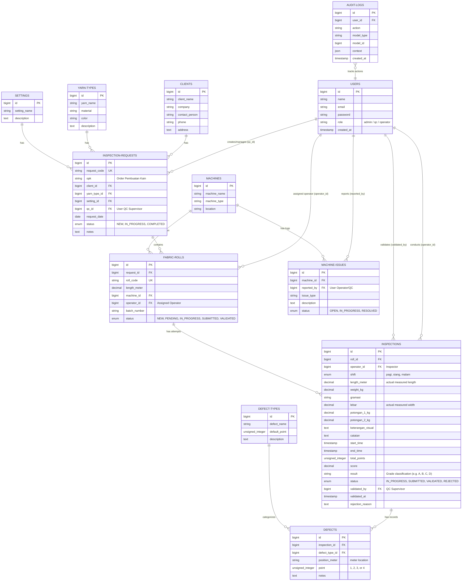

# Desain Sistem & Arsitektur - Digital Quality Control (QC) PT Duniatex

Dokumen ini menjelaskan rancangan arsitektur sistem, alur proses inspeksi kain, Entity Relationship Diagram (ERD), serta pemetaan struktur basis data menggunakan Laravel Migrations dan Eloquent ORM pada sistem Quality Control PT Duniatex.

---

## 1. Arsitektur Sistem (System Architecture)

Sistem Quality Control Duniatex dirancang menggunakan arsitektur **Model-View-Controller (MVC)** berbasis framework **Laravel** dengan basis data relasional **PostgreSQL**.

### Blok Diagram Arsitektur


### Peran Pengguna (User Roles)
Sistem memiliki 3 tingkat otorisasi pengguna yang disimpan di tabel `users`:
1. **Admin**: Mengelola data master (Klien, Mesin, Jenis Benang, Setting Mesin, Jenis Defect, Pengguna).
2. **QC / Supervisor**: Membuat permintaan inspeksi (`inspection_requests`), menunjuk operator, serta memvalidasi atau menolak hasil inspeksi kain.
3. **Operator**: Melakukan proses inspeksi kain di mesin, memasukkan data dimensi kain, mencatat cacat (defect) selama proses berjalan, dan mengirimkan hasil inspeksi.

---

## 2. Alur Proses Inspeksi Kain (Fabric Inspection Workflow)

Alur proses inspeksi kain dari awal pembuatan permintaan hingga validasi akhir dirancang sebagai berikut:



### Penilaian Grade Kain (Grading Logic)
Penilaian grade kain didasarkan pada sistem poin (biasanya **Sistem 4-Poin / 4-Point System** standar internasional):
- Poin defect diberikan berdasarkan panjang cacat (1, 2, 3, atau 4 poin).
- Total poin dihitung per roll kain.
- Skor akhir dihitung dengan rumus:
  $$\text{Score} = \frac{\text{Total Points} \times 3600}{\text{Length (meter)} \times \text{Width (inch)} \times 0.9144}$$
- Berdasarkan skor akhir tersebut, kain dikelompokkan ke dalam kelas mutu (Grade A, Grade B, dst.).

---

## 3. Entity Relationship Diagram (ERD)

Berikut adalah diagram relasi entitas (ERD) basis data PostgreSQL yang diimplementasikan dalam Duniatex Project:



---

## 4. Struktur Database (Laravel Migrations & Eloquent ORM)

Setiap entitas di atas diimplementasikan secara elegan menggunakan Laravel Migrations dan didukung oleh Model Eloquent ORM dengan relasi yang kuat.

### A. Tabel & Migrasi Utama

1. **`users`**
   - Model: `App\Models\User.php`
   - Keterangan: Menyimpan data pengguna dengan role-based authorization.

2. **`clients`**
   - Model: `App\Models\Client.php`
   - Keterangan: Data pembeli kain untuk validasi tujuan pengiriman/order.

3. **`machines`**
   - Model: `App\Models\Machine.php`
   - Keterangan: Daftar mesin tenun/rajut yang menghasilkan roll kain.

4. **`yarn_types`**
   - Model: `App\Models\YarnType.php`
   - Keterangan: Jenis benang (material, warna) yang digunakan pada kain.

5. **`settings`**
   - Model: `App\Models\Setting.php`
   - Keterangan: Setting mesin penenun untuk jenis order tertentu.

6. **`inspection_requests`**
   - Model: `App\Models\InspectionRequest.php`
   - Relasi:
     - `belongsTo(Client::class)`
     - `belongsTo(YarnType::class)`
     - `belongsTo(Setting::class)`
     - `belongsTo(User::class, 'qc_id')`
     - `hasMany(FabricRoll::class, 'request_id')`

7. **`fabric_rolls`**
   - Model: `App\Models\FabricRoll.php`
   - Relasi:
     - `belongsTo(InspectionRequest::class, 'request_id')`
     - `belongsTo(Machine::class)`
     - `belongsTo(User::class, 'operator_id')`
     - `hasMany(Inspection::class, 'roll_id')`
     - `hasOne(Inspection::class, 'roll_id')->latestOfMany()`

8. **`inspections`**
   - Model: `App\Models\Inspection.php`
   - Relasi:
     - `belongsTo(FabricRoll::class, 'roll_id')`
     - `belongsTo(User::class, 'operator_id')`
     - `belongsTo(User::class, 'validated_by')`
     - `hasMany(Defect::class)`

9. **`defects`**
   - Model: `App\Models\Defect.php`
   - Relasi:
     - `belongsTo(Inspection::class)`
     - `belongsTo(DefectType::class)`

10. **`defect_types`**
    - Model: `App\Models\DefectType.php`
    - Keterangan: Master poin dan nama cacat (misalnya: Benang Putus, Lusi Dobel, Oli/Kotoran).

11. **`machine_issues`**
    - Model: `App\Models\MachineIssue.php`
    - Relasi:
      - `belongsTo(Machine::class)`
      - `belongsTo(User::class, 'reported_by')`

12. **`audit_logs`**
    - Model: `App\Models\AuditLog.php`
    - Keterangan: Untuk melacak tindakan krusial pengguna (misalnya perubahan status inspeksi, penghapusan data roll) guna keamanan audit sistem.

---

### B. Contoh Definisi Relasi pada Eloquent Model

Sebagai contoh, keterkaitan antara `FabricRoll`, `Inspection`, dan `Defect` dinyatakan dengan jelas dalam kode PHP berikut:

```php
// app/Models/FabricRoll.php
class FabricRoll extends Model
{
    public function inspectionRequest()
    {
        return $this->belongsTo(InspectionRequest::class, 'request_id');
    }

    public function inspections()
    {
        return $this->hasMany(Inspection::class, 'roll_id');
    }

    public function latestInspection()
    {
        return $this->hasOne(Inspection::class, 'roll_id')->latestOfMany();
    }
}

// app/Models/Inspection.php
class Inspection extends Model
{
    public function roll()
    {
        return $this->belongsTo(FabricRoll::class, 'roll_id');
    }

    public function defects()
    {
        return $this->hasMany(Defect::class);
    }
}
```

---

## 5. Kesimpulan

Rancangan sistem ini terbukti **sangat terstruktur dan dinamis** untuk diimplementasikan pada database **PostgreSQL/MariaDB**. Penggunaan migration Laravel mempermudah pengelolaan skema basis data secara kolaboratif, sementara Eloquent ORM memastikan integritas relasi antar-entitas terjaga dengan baik guna meminimalkan kesalahan pencatatan data Quality Control pada proses produksi kain PT Duniatex.
